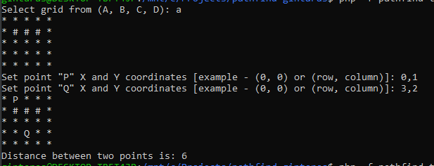

# Matrix Pathfind

Imagine representing a grid-shaped game map as a 2-dimensional array. Each value of this array is
boolean `true` or `false` representing whether that part of the map is passable (a floor) or blocked
(a wall).

Write a function that takes such a 2-dimensional array `A` and 2 vectors `P` and `Q`, with `0,0` being the top left corner of the map and returns the distance of the shortest path between those points, respecting the walls in the map.

eg. Given the map (where `.` is passable - `true`, and `#` is blocked - `false`)

```
. P . . .
. # # # .
. . . . .
. . Q . .
. . . . .
```

then `pathfind(A, P, Q)` should return `6`.

_Please avoid using libraries to implement the algorithmic side of this challenge, other libraries (such as PHPUnit or Jest for testing) are welcome._

## What to do

1. Implement the function described above in any mainstream language you wish
2. Provide unit tests for your submission
3. Fill in the section(s) below

## Comments Section

#### Runtime:

1. If both point on same cell - result is `0`
2. If there is impossible calculate path (grid key `B` for example) - result is `-1`
3. If path is calculated - result is `a number`

#### Validation (Invalid Argument Exception):

1. Prevent enter incorrect coordinates
2. Prevent choose non existent grid key. `D` key generates `random` grid with size of `8x8`

#### To Test:
1. Clone Repository
2. `cd` to Created Directory
3. Run `composer install`
4. Run PHPUnit `./vendor/bin/phpunit tests/`
5. Run App `php -f pathfind-task.php`

#### Example:



### What I'm Pleased With

### What I Would Have Done With More Time

1. I would put in Docker container
2. I would, maybe, do path search animation with JS on browser
